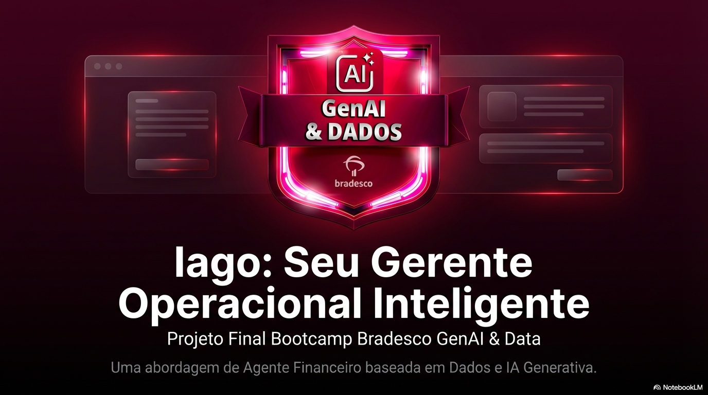
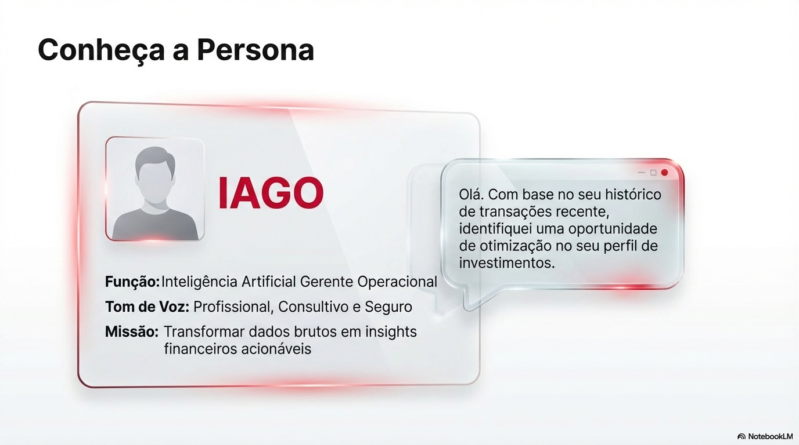
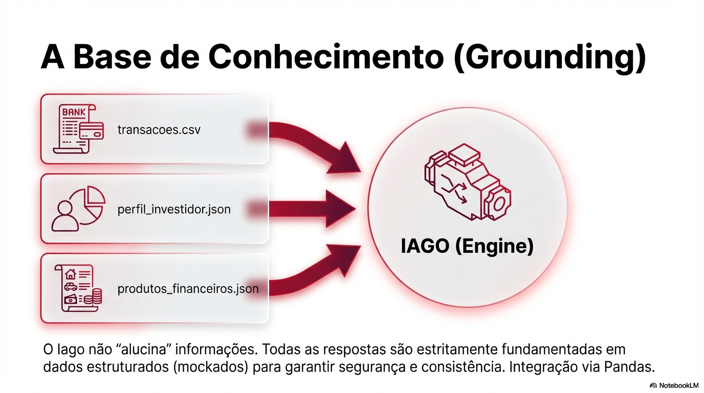
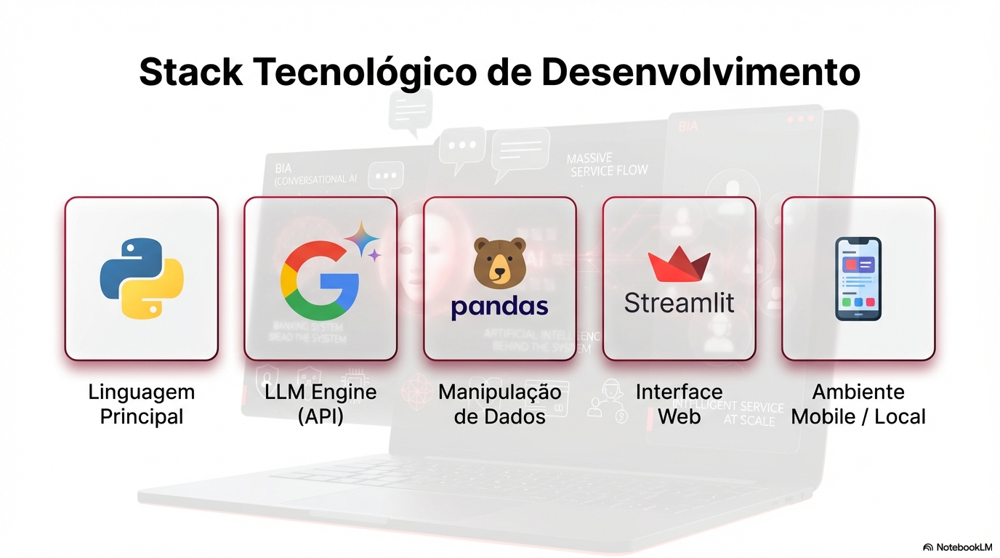
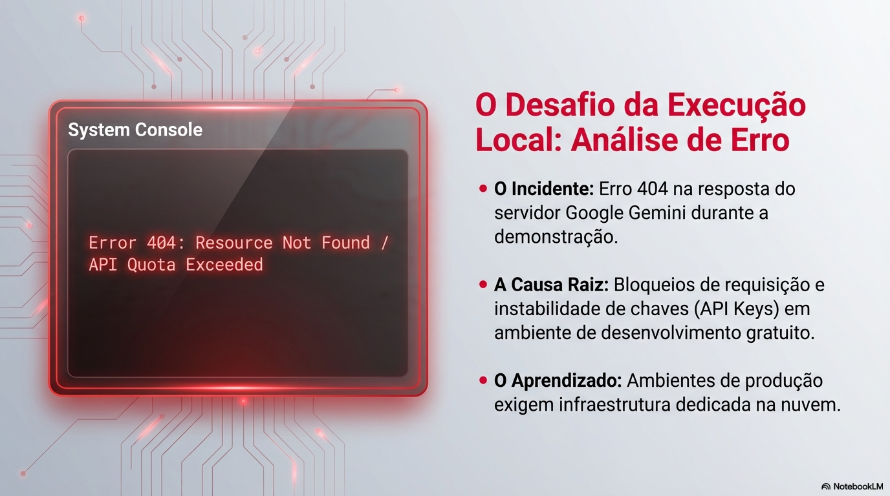
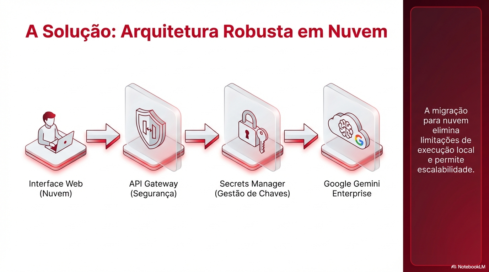
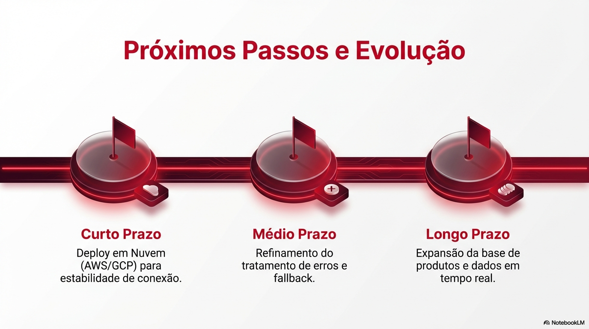

# Pitch (3 minutos)

> [!TIP]
## 🚀 Apresentação Executiva do IAGO

### 1. Visão Geral e Persona

*O IAGO foi concebido para ser um Gerente Operacional Inteligente, focado em proatividade financeira.*

*Definição de uma persona técnica e consultiva, garantindo empatia e autoridade nas respostas.*

---

### 2. Arquitetura e Base de Conhecimento (RAG)

*Utilização de RAG (Geração Aumentada por Recuperação) com dados mockados de transações e perfis para eliminar alucinações.*

*Stack robusta utilizando Python, Pandas para manipulação de dados e Google Gemini como motor de IA.*

---

### 3. Validação Técnica e Diagnóstico

*Transparência técnica: Diagnóstico do erro 404 de API identificado durante a execução em ambiente mobile.*

*Plano de mitigação para transição de ambiente local para infraestrutura escalável em nuvem.*

---

### 4. Impacto e Evolução

*Visão de futuro para integração com APIs bancárias reais e expansão do portfólio de investimentos.*

 
## Roteiro Sugerido

### 1. O Problema (30 seg)
> Qual dor do cliente você resolve?

Dificuldade de investidores em interpretar dados financeiros brutos e convertê-los em ações estratégicas personalizadas.

### 2. A Solução (1 min)
> Como seu agente resolve esse problema?

Um agente de IA com arquitetura RAG que consome arquivos JSON e CSV locais para fornecer consultoria financeira técnica e proativa.

### 3. Demonstração (1 min)
> Mostre o agente funcionando (pode ser gravação de tela)

Apresentação da estrutura de pastas, lógica do agente em Python e interface Streamlit integrada ao Google Gemini.

### 4. Diferencial e Impacto (30 seg)
> Por que essa solução é inovadora e qual é o impacto dela na sociedade?

Execução 100% em ambiente mobile e uso de dados estruturados para evitar alucinações, promovendo inclusão financeira tecnológica.

---

## Checklist do Pitch

- [✅] Duração máxima de 3 minutos
- [✅] Problema claramente definido
- [✅] Solução demonstrada na prática
- [✅] Diferencial explicado
- [✅] Áudio e vídeo com boa qualidade

---

## Link do Vídeo

> Cole aqui o link do seu pitch (YouTube, Loom, Google Drive, etc.)

https://youtu.be/C6Sqw-U8oBE
